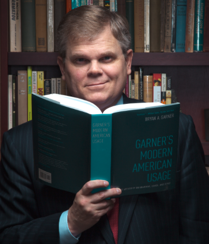

# Following these steps makes writing a short document easier.

1. The Madman thinks up the list of points to be made.
2. The Architect (I *should* change this to engineer) creates an outline of the writing.
3. The Carpenter writes the draft, as fast as possible without stopping. 
4. The Judge revises and edits the draft until it is ready.

# These authors can teach you what makes for good writing.

Much of what I believe about writing came from these mentors, probably roughly in order from top to bottom. It might help you to read them. That is why I am listing them here. (Bryan A Garner is awesome, by the way).

- [Bryan A. Garner](https://en.wikipedia.org/wiki/Bryan_A._Garner)
- [Barbara Minto](https://en.wikipedia.org/wiki/Barbara_Minto)
- [Steven Pinker](https://en.wikipedia.org/wiki/Steven_Pinker)

Bryan is a handsome devil, no?

{ width=250px }

# Try stepping away from the work after writing it. 

Step away from the work after you write it. Your brain will toss it around and add richness to the meaning. Meanwhile you will forget the exact wording. You will remember the essence, not the specifics. When you go back and start reading it to begin the revising-editing cycle, you will spot things to change. You will have fresh eyes.

# Revise and edit it until you are satisfied.

I like to think of revising as moving around big chunks. It is about overall structure. You might worry about the logical structure. If you follow something like the Minto Pyramid Principle, you will examine the document to see if it follows the pyramid structure. You may want to move a sentence up or down. You may want to split up a long sentence. I call all this "revising." I think it's from one of my writing mentors, but I cannot remember which one right now.

After revising, we do editing. Wrong. We do them concurrently. We do one a little bit, switch to the other, zoom in, zoom out. 

You can wander around the document. Look at the big picture. Does it flow? Does it add up? Are there good transitions? Are the sentences short and to the point? Are the paragraphs concise? Is the purpose of the writing obvious? 

Revising is improving structural choices. Editing is improving stylistic choices. It is about selecting words for their easy of understanding and -- maybe more importantly -- style. Style keeps the reader motivated to keep reading. It can be a slog. Writing with some style is a gift you give the reader. It's refreshment. 

Then there are word choices. My philosophy is shorter is better -- shorter words and shorter sentences. The shorter sentences idea came from Bryan A. Garner. After that, I started noticing: the writing I liked? It had shorter sentences. It is more lively or something. I just like it I guess. But what about shorter words?

> "I never write metropolis for seven cents because I can get the same price for city. I never write policeman because I can get the same money for cop." -- Mark Twain.

Shorter words I think are easier to understand by the reader. Consider these three competing descriptions:

- The four individuals working on site attempted to insert an aluminum fencepost into a cylindrical excavation when they experienced the sensation of electric shock.
- The four workers felt an electric shock while installing a febcepost in the ground.
- Four workers felt a shock while putting up a fencepost. 

Do you like one? I like the last one best. That's my fave. See? Short. Sentences.

Return to [Index](index.html)
